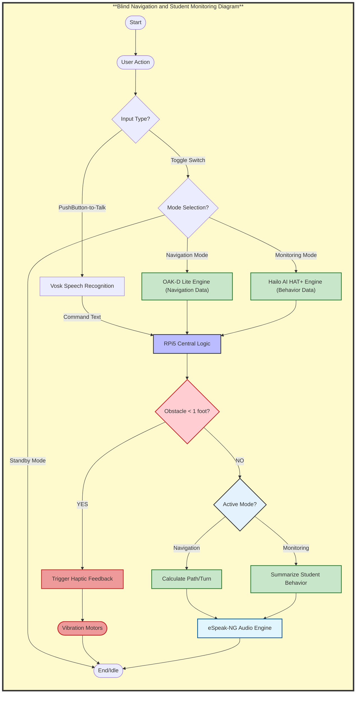

## 📐 Methodology Architecture (Block Diagram)

```mermaid
graph TD
    %% Define the single, large system container
    subgraph SYSTEM_CONTAINER ["**Blind Navigation and Student Monitoring Diagram**"]
        direction TB
        %% 0. Start
        Z([Start]) -->

        %% 1. Input Flow
        A([User Action]) --> B{Input Type?}
        
        B -->|Toggle Switch| C{Mode Selection?}
        B -->|PushButton-to-Talk| D["Vosk Speech Recognition"]
        D -->|Command Text| RPICPU

        %% 2. Mode Activation & Data Flow
        C -->|Navigation Mode| E["OAK-D Lite Engine (Navigation Data)"]
        C -->|Monitoring Mode| F["Hailo AI HAT+ Engine (Behavior Data)"]
        C -->|Standby Mode| K([End/Idle])
        
        E --> RPICPU
        F --> RPICPU
        
        %% 3. Central Processing & Safety Check
        RPICPU[RPi5 Central Logic] --> H{Obstacle < 1 foot?}

        %% 4. Decision Branches & Output
        
        %% Critical Safety Path - Haptic Only
        H -->|YES| I["Trigger Haptic Feedback"]
        I --> J([Vibration Motors])
        
        %% Normal Operation Path
        H -->|NO| L{Active Mode?}
        
        L -->|Navigation| M["Calculate Path/Turn"]
        L -->|Monitoring| N["Summarize Student Behavior"]
        
        M --> O["eSpeak-NG Audio Engine"]
        N --> O
    end

    %% Connect Outputs to the Final End State
    J --> K
    O --> K

    %% --- Styling for Clarity ---
    style SYSTEM_CONTAINER fill:#fffacd,stroke:#333,stroke-width:4px;
    style H fill:#ffcdd2,stroke:#c62828,stroke-width:2px
    style I fill:#ef9a9a,stroke:#c62828,stroke-width:2px
    style J fill:#ef9a9a,stroke:#c62828,stroke-width:2px
    style L fill:#e3f2fd,stroke:#333,stroke-width:2px
    style M fill:#c8e6c9,stroke:#2e7d32,stroke-width:2px
    style N fill:#c8e6c9,stroke:#2e7d32,stroke-width:2px
    style E fill:#c8e6c9,stroke:#2e7d32,stroke-width:2px
    style F fill:#c8e6c9,stroke:#2e7d32,stroke-width:2px
    style O fill:#e1f5fe,stroke:#01579b,stroke-width:2px
    style RPICPU fill:#bbf,stroke:#333,stroke-width:2px
```
