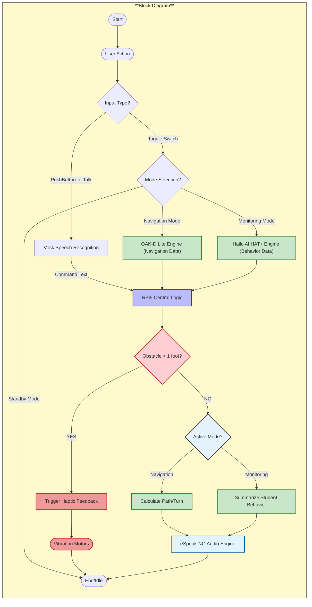

# SENSEY: An Intelligent Wearable Aid with Real-Time Object Detection and Multimodal Feedback for Inclusive Education

Welcome to the repository for **SENSEY**! This project is dedicated to developing an intelligent wearable aid designed to empower visually impaired teachers in inclusive education settings. SENSEY leverages cutting-edge AI-driven computer vision, specifically YOLOv8, combined with multimodal haptic and audio feedback to enhance classroom mobility, object identification, student interaction, and overall spatial awareness.

Our goal is to create a robust and efficient system that bridges the existing gaps in assistive technology, providing real-time, adaptive support for educators.

---

## ✨ Features & Project Components

This repository is structured to provide clear access to the various modules and functionalities that comprise the SENSEY wearable aid and its underlying AI infrastructure.

*   **Blind Navigation:**
    *   This core module implements the navigation logic and processes sensory data to provide guidance for visually impaired users. It integrates outputs from perception models to offer intuitive feedback.

*   **Depth Estimation Model:**
    *   Dedicated to 3D scene understanding, this component includes models and code for estimating the depth of objects using a stereo camera. It's crucial for simulating "Human Binocular Vision" and understanding obstacle distances in the environment.

*   **Face Recognition Folder:**
    *   Focuses on the facial identification capabilities essential for SENSEY. This includes code and notes for recognizing students within the classroom environment, supporting enhanced teacher-student interaction.

*   **Hardware:**
    *   Contains detailed documentation, design files (e.g., 3D CAD for mounting cases), and setup instructions for the physical components of the SENSEY wearable device, including the Raspberry Pi 5 enclosure, stereo camera mount, and battery holder.

*   **Ollama AI for summarizing the terminal prompt:**
    *   *(Note: This component appears to be a general AI development tool for enhancing developer workflow, rather than a direct feature of the SENSEY wearable aid. It's included here as part of the broader repository's AI solutions.)* Explores integrating Ollama AI for terminal output summarization.

*   **Pose Estimation Model:**
    *   Documents the development and initial progress of the pose estimation module. This is vital for detecting and tracking student behaviors and actions in real-time within the classroom.

*   **Text to Speech Folder:**
    *   Implements the text-to-speech functionalities that drive SENSEY's audio feedback system, allowing the device to provide clear, audible information to the user.

*   **WaveShare UPS Module 3S:**
    *   Manages the integration and functionality of the WaveShare UPS Module 3S, ensuring reliable power supply and extended operational time for the portable SENSEY device.

*   **README.md:**
    *   (You are currently reading this file!) Provides a comprehensive overview of the SENSEY project, its features, and guidance for development and contribution.

*   **Raspberry Pi5 AI HAT + Hailo installation notes:**
    *   Contains essential notes and guides for setting up the Raspberry Pi 5 with an AI HAT, specifically optimized for Hailo AI accelerators to ensure efficient on-device inference for SENSEY's various AI models.

---

## 🚀 Getting Started

To get a local copy of SENSEY's development environment and explore its components, follow these steps:

1.  Clone the repository: `git clone https://github.com/Sense-Say/SENSEY.git`
2.  Navigate to the specific module you wish to explore (e.g., `cd Depth Estimation Model`).
3.  Refer to the `README.md` files within individual folders or the `Hardware` folder for detailed setup, installation, and usage instructions for each component.

---

## 🛠️ Technologies & Tools

The SENSEY project leverages a diverse stack of technologies and tools:

*   **Core AI:** YOLOv8 (for object detection, pose estimation, face recognition)
*   **AI Accelerators:** Hailo AI HAT (on Raspberry Pi 5)
*   **Embedded Computing:** Raspberry Pi 5
*   **Camera System:** Stereo Camera (e.g., RealSense D435)
*   **Haptic Feedback:** Custom ESD Arm Sleeve with Coin Vibration Motors
*   **Audio Feedback:** Shokz OPENMOVE Bone Conduction Headphones (Text-to-Speech)
*   **Power Management:** WaveShare UPS Module 3S
*   **Development & Training:**
    *   Python
    *   Ultralytics YOLO Framework
    *   Roboflow (Dataset management)
    *   Google Colab (GPU-accelerated training)
    *   OpenCV (Image and video processing)
*   **Other AI Tools (within repository):** Ollama AI (for development utilities)

---

## 🤝 Contributing

We welcome contributions to the SENSEY project! If you have suggestions for improvements, new features, or want to report issues, please feel free to:

1.  Fork the repository.
2.  Create your feature branch (`git checkout -b feature/AmazingFeature`).
3.  Commit your changes (`git commit -m 'Add some AmazingFeature'`).
4.  Push to the branch (`git push origin feature/AmazingFeature`).
5.  Open a Pull Request.

---

## 📞 Contact

**Project Team:** Buco, Dogillo, Dorongon, Padre, Villariña

**Adviser:** Engr. Dennis Jefferson A. Amora, PECE, LPT

Project Link: `https://github.com/Sense-Say/SENSEY`

---
##

## 📐 Methodology Architecture 

---
This is the complete, professional `README.md` guide incorporating all the finalized logic, hardware roles, and design decisions we made, specifically using Markdown tables for clean visualization.

***

# 🧠 Eye-Link Assistant: Fused AI Navigation & Monitoring

This project details the architecture for a real-time assistive device for blind teachers, integrating the specialized power of the **OAK-D Lite** (for 3D Vision) and the **Hailo AI HAT+** (for high-speed behavior monitoring) on a single **Raspberry Pi 5**.

## I. SYSTEM ARCHITECTURE & CONTROL

The system is managed via a physical **3-Mode Toggle Switch** for clear, tactile state management.

| Mode | Hardware Focus | Primary Function | Audio Control / Trigger |
| :--- | :--- | :--- | :--- |
| **1. NAVIGATION** | **OAK-D Lite** (VIO, Depth) | Guiding the teacher (walking) via an audio compass and obstacle avoidance. | **Auto-Pilot:** Speaks only when an obstacle is detected or a turn is needed. |
| **2. STANDBY (MODE 2)** | **ALL AI INACTIVE** | Power saving. Used during lecturing/sitting to ensure complete silence. | **SILENCE.** |
| **3. MONITORING**| **Hailo AI HAT+** (Pose) | Tracking student behavior (hands, sleeping, cheating). | **ON-DEMAND:** Speaks only when the **Push-to-Talk button** is clicked. |

---

## II. SENSOR FUSION: The 3D 'Kinect' Data Model

The core innovation is fusing the data from the two separate AI chips into a reliable 3D coordinate (`X, Y, Z`) model, which is essential for accurate behavior analysis.

| Data Source | Data Provided | RPi5 Logic | Final Output (Use Case) |
| :--- | :--- | :--- | :--- |
| **Hailo AI HAT+** | `X, Y` Pixel Coordinates (2D Pose) | Provides the **lookup address** for the depth value. | *e.g., Nose is at pixel* |
| **OAK-D Lite** | `Z` Depth Map (mm) | Provides the **distance value** at the specified pixel location. | *e.g., Z-Depth at is 2100mm.* |
| **Final Fusion** | **X, Y, Z (3D Point)** | **Kinect Logic:** Runs geometry on the full 3D coordinate system. | *e.g., **`Z_Nose`** is closer than **`Z_Shoulder`** (Student is aggressively leaning).* |

---

## III. NAVIGATION ENGINE LOGIC (Mode 1)

The system uses a rigid, redundant framework to ensure the teacher is always aware of their location and immediate threats.

| System Aspect | Implementation Details | Key Geometric Rule |
| :--- | :--- | :--- |
| **Pathing** | **VIO (Visual Inertial Odometry):** Tracks movement for "Clew-like" path recording and retracing. | Distance measured in millimeters via OAK-D Stereo. |
| **Compass** | **8-Point ArUco Tags** (N, NE, S, SE, etc.) | Provides stable, magnetic-immune anchors. Python calculates `Target_Angle - Current_Angle`. |
| **Obstacle Avoidance** | **3-Zone Logic (L/C/R) + Depth:** OAK-D classifies obstacles by distance and position. | **Center (1m-2m):** *"Obstacle Center. Drift Right."* **Critical (<1ft):** **Haptic Vibration** + *"STOP."* |

---

## IV. MONITORING ENGINE LOGIC (Mode 3)

The geometry rules are designed to be view-agnostic and robust against students' typical slumping and seating positions.

| Behavior Detected | Geometric Rule (Based on Fused 3D Data) | Rationale |
| :--- | :--- | :--- |
| **Hand Raising** | **`Y_Wrist < Y_Eye`** (for either wrist) | A simple, reliable 2D rule. Wrist must be vertically higher than the eye level to be considered a question. |
| **Aggressive Slouch/Lean** | **`(Z_Shoulder - Z_Nose) > 300mm`** | **3D Rule:** Head is 30cm closer to the teacher than the shoulders. Indicates severe slumping or forward leaning. |
| **Cheating** | **`X_Nose` is outside `Shoulder_Width * 1.2`** | **2D Rule:** Head is positioned horizontally outside the profile of the body, indicating the student is looking sideways at a peer's desk. |

### The Non-LLM Behavior Summarizer

| Trigger | Logic | Example Audio Output |
| :--- | :--- | :--- |
| **Teacher Clicks Button** | System counts events in the buffer and fills a pre-written **Template** (no AI generation). | *"Two students have questions, and one student is sleeping."* |
| **Safety Breach (Auto)** | **Cheating/Suspicious Activity** detected. | *"ALERT! Student looking sideways on the right."* (Interrupts immediately). |
